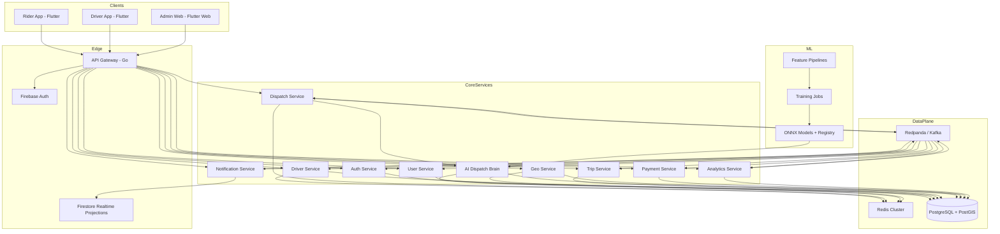

# Plan d’implémentation: Urban Mobility AI Platform

## Résumé

Objectif: transformer le dépôt actuel `motofix_niger` en une plateforme mondiale de mobilité intelligente, multi-services et prête pour la production, optimisée pour l’Afrique francophone, avec une architecture distribuée, événementielle et scalable à 1M+ utilisateurs.

Décisions verrouillées pour l’exécution:

- Backend principal: `Go`
- Refonte repo: `full rebuild`, mais avec coexistence temporaire du client Flutter actuel comme référence de migration
- Marché de lancement: `Afrique francophone`
- Structure clients: `3 apps séparées` (`rider_app`, `driver_app`, `admin_web`)
- Cloud cible: `Kubernetes agnostique`
- Cartographie: `Mapbox`
- Firestore: `temps réel uniquement`, jamais source de vérité métier
- Event bus: `Redpanda` compatible Kafka
- Core database: `PostgreSQL + PostGIS`, partitions de `trips` par ville

Le dépôt exploré aujourd’hui ne contient pas encore de backend microservices ni d’infrastructure Kubernetes. Il contient un seul client Flutter/Firebase monolithique avec des écrans user/driver/admin, des services Firestore, des règles Firestore relativement avancées, et un tracking Google Maps partiel. Le plan ci-dessous décrit la refonte complète à exécuter.

## Analyse de l’état actuel

### Réalité du dépôt

- Le dépôt est actuellement un projet Flutter unique à la racine avec `lib/`, `android/`, `ios/`, `web/`, `macos/`, `linux/`, `windows/`, `pubspec.yaml`.
- Le fichier [main.dart](file:///workspace/lib/main.dart#L13-L50) initialise directement `Firebase` et démarre une application unique `MotoFixApp`.
- Les providers Riverpod existent partiellement dans [providers.dart](file:///workspace/lib/core/di/providers.dart#L41-L79), mais `GoRouter` n’est pas en place.
- Le routage actuel repose sur `MaterialApp.routes` dans [routes.dart](file:///workspace/lib/core/config/routes.dart#L25-L48), ce qui n’est pas suffisant pour 3 apps séparées.
- Le domaine métier actuel vit principalement dans Firestore, par exemple [driver_service.dart](file:///workspace/lib/services/driver_service.dart#L51-L282) gère onboarding, disponibilité, acceptation, tracking et mutation de demandes côté client.
- Les règles [firestore.rules](file:///workspace/firestore.rules) montrent un modèle Firestore comme système transactionnel principal, ce qui est incompatible avec l’objectif `PostgreSQL + PostGIS` comme source de vérité.
- L’admin UI actuelle dans [admin_page.dart](file:///workspace/lib/pages/admin/admin_page.dart) lit directement Firestore.
- La cartographie temps réel actuelle utilise encore Google Maps dans [live_tracking_page.dart](file:///workspace/lib/features/map/presentation/live_tracking_page.dart#L17-L257), alors que la cible doit basculer sur `Mapbox`.
- Le dashboard carte simplifié [map_page.dart](file:///workspace/lib/pages/home/map_page.dart#L7-L216) est encore partiellement mocké.
- Aucun dossier `Dockerfile`, `k8s`, `infra`, `services`, `go.mod`, `go.work` ou backend n’existe encore.

### Écart entre l’existant et la cible

- Aujourd’hui: client mobile/web monolithique + Firebase direct
- Cible: monorepo plateforme avec 10 microservices obligatoires + API Gateway + IA dispatch + infra Kubernetes + observabilité + sécurité Zero Trust
- Aujourd’hui: logique dispatch et tracking partiellement côté client
- Cible: logique critique 100% backend, événementielle, idempotente, auditée
- Aujourd’hui: Firestore transactionnel
- Cible: Postgres/PostGIS transactionnel, Redis GEO temps réel, Firestore projection temps réel
- Aujourd’hui: une seule app
- Cible: `rider_app`, `driver_app`, `admin_web`

## Architecture cible

### Diagramme logique



### Principes d’architecture

- Source de vérité transactionnelle: `PostgreSQL + PostGIS`
- Bus d’événements: `Redpanda` avec contrats versionnés
- Temps réel opérationnel: `Redis Cluster` pour GEO, cache, locks, rate limit, idempotence
- Temps réel client: `Firestore` en projection seulement pour `active_trip_state`, `driver_presence_view`, `notifications_view`, `admin_live_view`
- Edge: `API Gateway Go` avec auth, rate limiting, idempotence, routing et logging
- RPC interne: `gRPC` pour chemins critiques, `REST/JSON` côté clients via Gateway
- Communication asynchrone: `Kafka topics` + consumers idempotents
- Sécurité: `Zero Trust`, RBAC strict, chiffrement PII, audit logs systématiques

## Structure cible du monorepo

```text
/workspace
  /apps
    /rider_app
    /driver_app
    /admin_web
  /packages
    /dart
      /ui_kit
      /app_core
      /networking
      /auth_sdk
      /mapbox_sdk
      /realtime_sdk
  /proto
    /mobility/v1
    /events/v1
  /services
    /api-gateway
    /auth-service
    /user-service
    /driver-service
    /trip-service
    /dispatch-service
    /ai-dispatch-brain
    /geo-service
    /payment-service
    /notification-service
    /analytics-service
  /libs
    /go
      /platform
      /events
      /authz
      /observability
      /postgres
      /redisx
      /kafkax
      /firestorex
      /idempotency
      /outbox
  /db
    /postgres
      /migrations
      /seed
  /ml
    /feature-pipelines
    /training
    /evaluation
    /models
  /infra
    /docker
    /kubernetes
      /base
      /overlays
    /helm
    /terraform
    /observability
  /docs
    /architecture
    /api
    /ops
```

## Changements proposés

### 1. Workspace, standards et migration du dépôt

#### Fichiers existants à reprendre

- `/workspace/README.md`
  - Remplacer le README template Flutter par un document plateforme complet: vision, architecture, exécution locale, CI/CD, environnements.
- `/workspace/pubspec.yaml`
  - Le convertir en manifeste workspace pour outillage monorepo Dart.
- `/workspace/firebase.json`
  - Le recentrer sur Firestore projections temps réel, hosting admin web si nécessaire, et émulateurs.
- `/workspace/firestore.rules`
  - Le réécrire pour n’autoriser que les vues temps réel dérivées et jamais les mutations métier critiques.
- `/workspace/firestore.indexes.json`
  - Le recalibrer sur les collections de projection temps réel.
- `/workspace/lib/**`, `/workspace/android/**`, `/workspace/ios/**`, `/workspace/web/**`, `/workspace/test/**`
  - Les conserver temporairement comme base de comparaison et de migration, puis les déprécier au profit des nouvelles apps sous `apps/`.

#### Nouveaux fichiers/dossiers à créer

- `/workspace/go.work`
  - Workspace Go racine pour tous les microservices et libs partagées.
- `/workspace/melos.yaml`
  - Orchestration Flutter/Dart multi-apps et packages partagés.
- `/workspace/.github/workflows/*.yml`
  - Pipelines CI pour lint, tests, build Docker, scans sécurité, manifests Kubernetes.
- `/workspace/docs/architecture/*.md`
  - ADRs, diagrammes C4, contrats d’événements, politiques sécurité.

#### Stratégie de migration

- Ne pas brancher de logique critique supplémentaire dans l’app racine actuelle.
- Construire la nouvelle plateforme dans `apps/`, `services/`, `libs/`, `infra/`.
- Migrer les concepts utiles existants:
  - design system partiel depuis `lib/core/theme/**` et `lib/shared/widgets/**`
  - auth/repositories depuis `lib/features/**`
  - modèles métier actuels comme matériau de mapping seulement, pas comme contrats définitifs
- Déclasser progressivement les accès directs Firestore du client.

### 2. API Gateway obligatoire

#### Dossier

- `/workspace/services/api-gateway`

#### Contenu

- `cmd/api-gateway/main.go`
- `internal/http/router.go`
- `internal/http/middleware/auth.go`
- `internal/http/middleware/rate_limit.go`
- `internal/http/middleware/idempotency.go`
- `internal/http/middleware/request_context.go`
- `internal/http/handlers/*.go`
- `internal/clients/*.go`
- `internal/config/*.go`
- `internal/logging/*.go`
- `internal/openapi/openapi.yaml`

#### Responsabilités

- Vérification Firebase ID token
- Échange token externe -> session JWT interne
- RBAC par rôle `user`, `driver`, `mechanic`, `admin`
- Rate limiting Redis par user, device, IP, endpoint
- Idempotency keys sur booking, paiement, annulation
- Routing REST vers microservices internes
- Injection corrélation `trace_id`, `user_id`, `city_id`, `country_code`
- Audit de chaque appel critique

#### Décision technique

- Gateway écrite en `Go` avec `chi`
- Clients internes en `gRPC`
- Contrat externe `REST/JSON`

### 3. Auth Service

#### Dossier

- `/workspace/services/auth-service`

#### Responsabilités

- Intégration `Firebase Auth`
- Mapping `firebase_uid -> internal_account_id`
- Session JWT interne signée côté backend
- Gestion rôles, permissions et claims internes
- Admin 2FA enforcement
- Rotation de refresh tokens, révocation, device sessions

#### Base de données

- Schéma Postgres `auth`
- Tables:
  - `accounts`
  - `sessions`
  - `roles`
  - `permissions`
  - `account_roles`
  - `admin_mfa_challenges`
  - `auth_audit_logs`

#### Événements

- `auth.account.created`
- `auth.session.created`
- `auth.session.revoked`
- `auth.role.changed`

### 4. User Service

#### Dossier

- `/workspace/services/user-service`

#### Responsabilités

- Profil, préférences, historique résumé, réputation
- PII chiffrée au repos: téléphone, email
- Gestion d’adresses favorites, contacts de sécurité
- Score réputation calculé à partir d’incidents, annulations, paiements et fraudes

#### Base de données

- Schéma `user`
- Tables:
  - `users`
  - `user_preferences`
  - `saved_addresses`
  - `user_reputation_scores`
  - `user_history_snapshots`

#### Événements

- `user.profile.updated`
- `user.reputation.updated`

### 5. Driver Service

#### Dossier

- `/workspace/services/driver-service`

#### Responsabilités

- Onboarding chauffeur/mécanicien/remorqueuse
- Documents KYC/KYV
- Vehicle types `moto`, `car`, `mechanic_van`, `tow_truck`
- State machine disponibilité:
  - `offline -> idle -> reserved -> en_route_pickup -> on_trip -> unavailable -> suspended`
- Ingestion GPS 2-10 sec
- Détection stale/offline
- Publication présence temps réel

#### Base de données

- Schéma `driver`
- Tables:
  - `drivers`
  - `driver_documents`
  - `vehicles`
  - `driver_state_transitions`
  - `driver_locations_raw`
  - `driver_location_snapshots`

#### Redis

- GEO set par ville et type de véhicule
- Keyspace présence:
  - `geo:city:{city_id}:{vehicle_type}`
  - `driver:presence:{driver_id}`
  - `driver:stale:{driver_id}`

#### Événements

- `driver.onboarded`
- `driver.availability.changed`
- `driver.location.updated`
- `driver.stale.detected`

### 6. Trip Service

#### Dossier

- `/workspace/services/trip-service`

#### Responsabilités

- Orchestration lifecycle:
  - `requested -> matched -> offered -> accepted -> started -> completed -> cancelled`
- Gestion type de service:
  - ride moto
  - ride car
  - mechanic on-demand
  - tow truck
- Gestion prix, distance, ETA, annulation, preuves de fin de course
- Outbox d’événements métier

#### Base de données

- Schéma `trip`
- Tables:
  - `trips`
  - `trip_offers`
  - `trip_waypoints`
  - `trip_status_history`
  - `trip_quotes`
  - `trip_cancellations`

#### Partitionnement

- `trips` partitionnée par `city_code`
- Sous-partition temporelle mensuelle si volume élevé

#### Événements

- `trip.requested`
- `trip.matched`
- `trip.offered`
- `trip.accepted`
- `trip.started`
- `trip.completed`
- `trip.cancelled`

### 7. Dispatch Service

#### Dossier

- `/workspace/services/dispatch-service`

#### Responsabilités

- Matching temps réel
- Multi-offer dispatch
- Fallback chain
- SLA timers
- Réessais contrôlés
- Gestion timeout, refus, non-réponse, stale drivers
- Coordination avec `ai-dispatch-brain`

#### Composants internes

- `internal/matching/candidate_fetcher.go`
- `internal/matching/offer_orchestrator.go`
- `internal/matching/fallback_chain.go`
- `internal/matching/sla_timer.go`
- `internal/locks/redis_lock.go`
- `internal/projections/firestore_sync.go`

#### SLA cibles

- Fetch candidats: `< 20 ms`
- Ranking IA: `< 30 ms`
- Décision dispatch totale: `< 100 ms`

#### Événements

- `dispatch.request.received`
- `dispatch.offer.sent`
- `dispatch.offer.expired`
- `dispatch.offer.accepted`
- `dispatch.fallback.started`

### 8. AI Dispatch Brain

#### Dossier

- `/workspace/services/ai-dispatch-brain`
- `/workspace/ml`

#### Responsabilités

- Score dispatch
- ETA prediction
- Acceptance probability
- Demand prediction
- Swarm repositioning
- Surge pricing
- Traffic fallback heuristics
- Hotspot clustering villes Afrique

#### Scoring v1 de production

- Score composite temps réel:
  - distance pondérée
  - rating driver
  - disponibilité réelle
  - trafic estimé
  - compatibilité véhicule/service
  - probabilité d’acceptation
  - pénalité stale GPS
  - pénalité fraude/comportement anormal

#### Architecture ML

- Features online en Redis/Postgres
- Offline training jobs en `/workspace/ml/training`
- Export des modèles en `ONNX`
- Inference en Go via runtime ONNX
- Fallback heuristique embarqué si modèle indisponible ou bande passante faible

#### Modules attendus

- `/workspace/services/ai-dispatch-brain/internal/scoring`
- `/workspace/services/ai-dispatch-brain/internal/eta`
- `/workspace/services/ai-dispatch-brain/internal/acceptance`
- `/workspace/services/ai-dispatch-brain/internal/demand`
- `/workspace/services/ai-dispatch-brain/internal/surge`
- `/workspace/services/ai-dispatch-brain/internal/swarm`
- `/workspace/services/ai-dispatch-brain/internal/fallback`
- `/workspace/ml/feature-pipelines`
- `/workspace/ml/evaluation`
- `/workspace/ml/models`

#### Événements

- `ai.demand.predicted`
- `ai.surge.updated`
- `ai.swarm.repositioning.created`
- `ai.acceptance.scored`

### 9. Geo Service

#### Dossier

- `/workspace/services/geo-service`

#### Responsabilités

- PostGIS queries
- Redis GEO indexing
- Route estimation
- ETA calculation
- Zones de couverture et polygones
- Stabilité GPS et smoothing

#### Décisions techniques

- Provider carte/geocoding: `Mapbox`
- Fallback route/ETA:
  - heuristique locale si API externe indisponible
- Filtrage GPS:
  - smoothing + outlier rejection
  - Kalman optionnel, activé pour tracking conducteur

#### Base de données

- Schéma `geo`
- Tables:
  - `zones`
  - `zone_polygons`
  - `demand_heatmap`
  - `road_snapshots`
  - `eta_calibration_history`

### 10. Payment Service

#### Dossier

- `/workspace/services/payment-service`

#### Responsabilités

- Validation server-side only
- Paiements `Airtel Money`, `Moov Money`, `cash`, `card optional`
- Idempotency keys
- Ledger interne
- Reconciliation
- Anti-fraude transactionnelle

#### Base de données

- Schéma `payment`
- Tables:
  - `payments`
  - `payment_attempts`
  - `payment_methods`
  - `payment_webhooks`
  - `wallet_ledger`
  - `payouts`

#### Anti-fraude

- Velocity checks
- Multi-account detection
- Device fingerprint correlation
- Duplicate payment detection
- Abnormal amount pattern detection

#### Événements

- `payment.authorized`
- `payment.captured`
- `payment.failed`
- `payment.cash.recorded`
- `fraud.payment.signal.created`

### 11. Notification Service

#### Dossier

- `/workspace/services/notification-service`

#### Responsabilités

- FCM
- SMS fallback optionnel Africa mode
- Templates transactionnels
- Inbox temps réel via Firestore projection
- Retentatives et DLQ

#### Événements

- `notification.trip.offer`
- `notification.trip.accepted`
- `notification.trip.started`
- `notification.trip.completed`
- `notification.payment.failed`
- `notification.driver.repositioning`

### 12. Analytics Service

#### Dossier

- `/workspace/services/analytics-service`

#### Responsabilités

- Demand heatmaps
- Driver performance
- Revenue analytics
- Fraud analytics
- KPI ops
- Export dashboards admin

#### Base de données

- Schéma `analytics`
- Tables:
  - `trip_fact_daily`
  - `driver_performance_daily`
  - `revenue_fact_daily`
  - `fraud_signals`
  - `audit_logs`

#### Événements

- Consomme tous les événements métier normalisés

### 13. Contrats d’événements Kafka / Redpanda

#### Dossier

- `/workspace/proto/events/v1`
- `/workspace/docs/architecture/event-flows.md`

#### Topics à figer

- `auth.account-events.v1`
- `user.profile-events.v1`
- `driver.state-events.v1`
- `driver.location-events.v1`
- `trip.lifecycle-events.v1`
- `dispatch.offer-events.v1`
- `payment.events.v1`
- `notification.events.v1`
- `analytics.ingest.v1`
- `fraud.signals.v1`
- `geo.zone-events.v1`
- `ai.predictions.v1`

#### Règles d’implémentation

- Payload Protobuf versionné
- Clé de partition:
  - `city_id` pour flux géographiques
  - `trip_id` pour lifecycle trip
  - `driver_id` pour présence
- Consumers idempotents
- DLQ par domaine
- Outbox pattern obligatoire sur services transactionnels

### 14. Database design PostgreSQL + PostGIS

#### Dossier

- `/workspace/db/postgres/migrations`

#### Fichiers attendus

- `0001_extensions.sql`
- `0002_auth.sql`
- `0003_user.sql`
- `0004_driver.sql`
- `0005_trip.sql`
- `0006_geo.sql`
- `0007_payment.sql`
- `0008_notification.sql`
- `0009_analytics.sql`
- `0010_audit_and_fraud.sql`

#### Entités obligatoires

- `users`
- `drivers`
- `vehicles`
- `trips`
- `payments`
- `zones`
- `demand_heatmap`
- `audit_logs`
- `fraud_signals`

#### Indexes obligatoires

- PostGIS `GIST` sur zones et positions
- `(city_code, created_at desc)` sur `trips`
- `(driver_id, status, updated_at desc)` sur `trips`
- `(user_id, created_at desc)` sur `payments`
- `(signal_type, created_at desc)` sur `fraud_signals`
- Partial indexes sur records actifs

### 15. Firestore temps réel uniquement

#### Fichiers existants à modifier

- `/workspace/firestore.rules`
- `/workspace/firestore.indexes.json`
- `/workspace/firebase.json`

#### Collections cibles

- `active_trips/{tripId}`
- `driver_presence/{driverId}`
- `user_notifications/{userId}/items/{notificationId}`
- `admin_live_metrics/{cityId}`

#### Règles

- Aucune mutation critique directement depuis client
- Écriture autorisée uniquement depuis backend service accounts
- Lecture limitée par RBAC et ownership

### 16. Flutter apps séparées

#### Dossiers

- `/workspace/apps/rider_app`
- `/workspace/apps/driver_app`
- `/workspace/apps/admin_web`
- `/workspace/packages/dart/ui_kit`
- `/workspace/packages/dart/app_core`
- `/workspace/packages/dart/networking`
- `/workspace/packages/dart/auth_sdk`
- `/workspace/packages/dart/mapbox_sdk`
- `/workspace/packages/dart/realtime_sdk`

#### Architecture commune

- Clean Architecture
- Riverpod
- GoRouter
- Feature-first
- Repositories branchés sur Gateway, jamais sur Firestore direct pour le core métier

#### Rider App

- Booking
- Live tracking temps réel
- Paiement
- Historique
- Profil
- Safety center

#### Driver App

- Online/offline
- Accept/decline
- Navigation Mapbox
- Repositioning IA
- Wallet/revenue
- Documents/KYC

#### Admin Web

- Live map type Snapchat
- Monitoring fraude
- Analytics
- Contrôle chauffeurs
- SLA dispatch
- Recherche incidents et audit trail

#### Migration depuis l’existant

- Reprendre les idées visuelles de `lib/core/theme/**`, `lib/shared/widgets/**`, `lib/pages/**`
- Déporter les flux métier Firestore vers SDK réseau Gateway
- Remplacer Google Maps par Mapbox
- Ne conserver Firestore côté apps que pour vues temps réel projetées

### 17. Infra Docker / Kubernetes

#### Dossiers

- `/workspace/infra/docker`
- `/workspace/infra/kubernetes/base`
- `/workspace/infra/kubernetes/overlays/dev`
- `/workspace/infra/kubernetes/overlays/staging`
- `/workspace/infra/kubernetes/overlays/prod`
- `/workspace/infra/helm`
- `/workspace/infra/terraform`
- `/workspace/infra/observability`

#### Manifestes attendus

- Deployment par service
- HPA par service
- PDB
- NetworkPolicy
- ConfigMap/Secret references
- Ingress
- ServiceMonitor
- CronJobs ML/analytics
- Redpanda, Redis, PostgreSQL opérés ou managés selon environnement

#### Scaling cible

- API Gateway horizontal
- Dispatch Service séparé en pool critique
- AI Brain séparé CPU-bound
- Redis Cluster multi-shards
- Redpanda 3+ brokers
- PostgreSQL primaire + replicas lecture + partitionnement `trips`

### 18. Sécurité Zero Trust

#### Bibliothèques/fichiers

- `/workspace/libs/go/authz`
- `/workspace/libs/go/platform/security`
- `/workspace/docs/ops/security-runbook.md`

#### Contrôles obligatoires

- Validation d’entrée stricte partout
- RBAC
- Chiffrement PII
- Audit logging systématique
- Admin 2FA
- Rate limiting par user et endpoint
- Secrets hors repo
- Signature des webhooks paiement
- Network policies inter-services
- Détection d’anomalies

### 19. Observabilité et exploitation

#### Dossiers

- `/workspace/infra/observability`
- `/workspace/docs/ops`

#### Outils et livrables

- OpenTelemetry
- Prometheus
- Grafana
- Loki
- Tempo ou Jaeger
- Dashboards:
  - dispatch latency
  - ETA accuracy
  - driver stale rate
  - payment failure rate
  - fraud signal rate
  - Firestore projection lag

### 20. Investisseur-ready technical pitch

#### Dossier

- `/workspace/docs/architecture/investor-technical-pitch.md`

#### Contenu

- Pourquoi l’architecture est défendable
- Pourquoi elle est meilleure pour contexte Afrique
- Barrières technologiques:
  - dispatch IA
  - data network fallback
  - geo resilience
  - fraud engine
  - ops observability

## Contrats fonctionnels et interfaces à figer pendant l’exécution

### APIs externes Gateway

- `POST /v1/auth/session/exchange`
- `GET /v1/me`
- `PATCH /v1/me`
- `POST /v1/drivers/onboarding`
- `POST /v1/drivers/location`
- `POST /v1/trips/quote`
- `POST /v1/trips`
- `POST /v1/trips/{tripId}/cancel`
- `POST /v1/trips/{tripId}/accept`
- `POST /v1/trips/{tripId}/start`
- `POST /v1/trips/{tripId}/complete`
- `POST /v1/payments/intents`
- `POST /v1/payments/webhooks/{provider}`
- `GET /v1/admin/live-map`
- `GET /v1/admin/analytics/*`

### Frontières de service

- `Auth Service` seul propriétaire sessions et rôles
- `User Service` seul propriétaire profil et préférences
- `Driver Service` seul propriétaire état chauffeur et véhicules
- `Trip Service` seul propriétaire lifecycle trip
- `Dispatch Service` seul propriétaire orchestration des offres
- `AI Dispatch Brain` ne mutera pas `trips` directement, il renvoie ranking/predictions
- `Payment Service` seul propriétaire statuts de paiement
- `Notification Service` seul propriétaire fanout des notifications
- `Analytics Service` lit les événements, pas les tables OLTP comme source primaire d’agrégation

## Plan d’exécution ordonné

### Phase A. Bootstrap plateforme

- Créer la structure monorepo `apps/`, `services/`, `libs/`, `proto/`, `db/`, `infra/`, `ml/`, `docs/`
- Mettre en place `go.work`, `melos.yaml`, CI, conventions, génération proto
- Ajouter libs Go communes: config, logging, tracing, db, kafka, redis, authz, idempotence, outbox

### Phase B. Fondations backend

- Implémenter `api-gateway`, `auth-service`, `user-service`
- Mettre en place Postgres + migrations + schémas de base
- Brancher Firebase Auth -> session interne
- Exposer premiers endpoints Gateway

### Phase C. Domaine mobilité

- Implémenter `driver-service`, `trip-service`, `geo-service`
- Introduire Redis GEO et ingestion GPS
- Basculer quotes/trips du client vers backend
- Poser projections Firestore temps réel

### Phase D. Dispatch et IA

- Implémenter `dispatch-service`
- Implémenter `ai-dispatch-brain`
- Définir scoring, ETA, acceptance, demand prediction, surge, swarm
- Câbler topics Kafka, timers SLA, fallback chain

### Phase E. Paiement, notifications, analytics

- Implémenter `payment-service`
- Implémenter `notification-service`
- Implémenter `analytics-service`
- Ajouter fraude, audits, dashboards

### Phase F. Apps Flutter

- Construire `rider_app`
- Construire `driver_app`
- Construire `admin_web`
- Intégrer Mapbox, realtime SDK, auth SDK, networking SDK
- Reprendre et améliorer l’expérience visuelle existante en version production

### Phase G. Infra, hardening, publication

- Dockerfiles, manifests Kubernetes, HPAs, observabilité
- Tests charge, chaos léger, sécurité, reprise incident
- Checklist publication stores/web, runbooks on-call, DR

## Hypothèses et décisions

- Le code Flutter existant est un prototype fonctionnel et non la base finale de production.
- La logique critique sera déplacée hors client.
- Les 10 microservices obligatoires seront implémentés exactement comme demandés, plus `api-gateway` comme composant edge obligatoire.
- `Firestore` reste limité aux projections temps réel.
- `Mapbox` est le provider baseline; fallback heuristique local côté backend pour ETA si provider indisponible.
- `Redpanda` est préféré à Kafka natif pour simplifier l’opération tout en gardant compatibilité Kafka.
- `Go` est utilisé pour tous les microservices critiques; les jobs d’entraînement ML peuvent utiliser Python sous `/workspace/ml` si nécessaire pour exporter des modèles consommés par le service Go.
- La production est pensée multi-pays Afrique francophone, avec `country_code`, `city_code`, `currency_code`, `payment_provider` comme dimensions de configuration dès la première version.

## Vérification prévue pendant l’exécution

### Vérification code et architecture

- Lint, tests unitaires et tests intégration par service
- Validation des contrats Protobuf/OpenAPI
- Vérification migrations Postgres
- Vérification règles Firestore projection-only

### Vérification performance

- Bench API Gateway
- Bench Dispatch Service
- Bench AI ranking
- Tests charge à `10k rps` agrégés
- Vérification latence dispatch `< 100 ms` sur chemin critique

### Vérification produit

- Parcours rider complet
- Parcours driver complet
- Parcours admin live map
- Cas offline / réseau faible / GPS instable
- Paiement cash et mobile money

### Vérification sécurité

- Tests authn/authz
- Tests rate limiting
- Tests idempotence
- Scan dépendances
- Vérification chiffrement PII
- Audit logs sur toutes les actions critiques

### Vérification déploiement

- Build Docker reproductible
- Déploiement dev/staging/prod via manifests
- Smoke tests post-deploy
- HPA et dashboards observabilité actifs

## Critères de succès

- 3 apps Flutter séparées publiables
- 10 microservices obligatoires + Gateway opérationnels
- Pipeline événementiel Kafka/Redpanda en place
- Postgres/PostGIS + Redis + Firestore projection-only fonctionnels
- Dispatch IA temps réel implémenté avec fallback faible bande passante
- Sécurité Zero Trust et audit trail intégrés
- Infra Kubernetes prête production avec autoscaling
- Documentation architecture et pitch technique investisseur livrés
